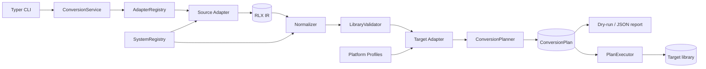
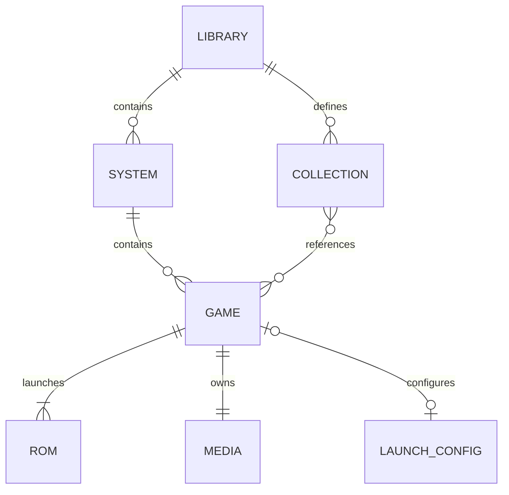
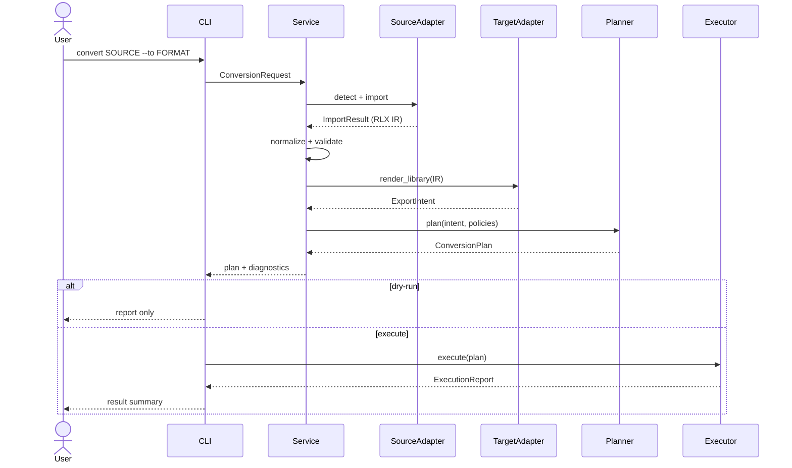

# RetroLibX V1 Technical Design

## 1. Goals and constraints

This design implements the confirmed [V1 requirements](requirements.md) in an empty repository. The primary design goals are format isolation, source safety, deterministic output, useful partial-failure handling, and straightforward third-party extension.

Hard constraints:

- Python 3.12+, `uv`, `src` package layout.
- All conversions follow Source → RLX IR → Target.
- Adapter describes a data format; Profile describes platform layout conventions.
- Parsing and rendering cannot perform migration file operations.
- Planning is side-effect-free; only the executor may mutate the target.
- No GUI, network service, scraper, save/BIOS migration, or incremental synchronization in V1.

## 2. Technology choices

| Concern | Choice | Rationale |
|---|---|---|
| CLI | Typer | Typed command surface, shell completion, Click-compatible testing |
| Models/config | Pydantic v2 | Validation, JSON serialization, discriminated operation models |
| Terminal output | Rich | Tables, progress, warnings, consistent stderr/stdout behavior |
| XML | lxml | Safe, mature parsing and deterministic pretty writing |
| YAML registry | PyYAML | Small versioned human-maintained system registry |
| User paths | platformdirs | Future config/cache placement without OS-specific branches |
| Testing | pytest, pytest-cov | Unit, fixture, golden, and integration coverage |
| Quality | Ruff, mypy | Formatting/linting and strict static checking |

Optional accelerators (`orjson`, `xxhash`, `rapidfuzz`, Pillow) are not required for V1 correctness. The design leaves narrow extension points for them without making them mandatory dependencies.

## 3. System architecture



The diagram intentionally keeps RLX IR and ConversionPlan as the two focal state boundaries. Adapters never call the executor and never depend on one another.

### Layer responsibilities

| Layer | Owns | Must not own |
|---|---|---|
| CLI | Argument validation, exit codes, presentation | Format parsing, direct file copying |
| Application service | Workflow orchestration | Platform-specific field mapping |
| Adapters | Detection, parse-to-IR, render intent | Cross-format conversion, file execution |
| Profiles | Directory/system/media conventions | Metadata syntax parsing |
| Core | Models, normalization, matching, validation | CLI or specific platform policy |
| Planner | Destination resolution, conflicts, data-loss warnings | Filesystem mutation |
| Executor | Approved target mutations and progress events | Format interpretation |

## 4. Package structure

```text
src/retrolibx/
├── __init__.py
├── cli.py
├── errors.py
├── application/
│   ├── service.py
│   └── reports.py
├── core/
│   ├── models.py
│   ├── options.py
│   ├── normalize.py
│   ├── matcher.py
│   ├── validation.py
│   ├── operations.py
│   ├── planner.py
│   └── executor.py
├── adapters/
│   ├── base.py
│   ├── registry.py
│   ├── retroarch/{adapter.py,playlist.py,media.py}
│   ├── emulationstation/{adapter.py,gamelist.py,media.py}
│   ├── rocknix/{adapter.py,profile.py}
│   ├── esde/{adapter.py,profile.py,media.py}
│   └── pegasus/{adapter.py,metadata.py,media.py}
├── profiles/
│   ├── base.py
│   └── generic_es.py
├── registry/
│   ├── systems.py
│   └── systems.yaml
└── utils/{dates.py,files.py,names.py,paths.py}
```

Tests mirror the package layout and add `fixtures/`, `golden/`, and end-to-end `integration/` suites.

## 5. Domain model

All domain models derive from a shared strict Pydantic base configured for explicit serialization. Every collection uses `default_factory`.



Key model details:

- `Library`: source format/path, systems, collections, global metadata, diagnostics.
- `System`: canonical ID, display names, platform IDs, games, source metadata.
- `Game`: optional stable source ID, names, ROMs, semantic media, descriptive metadata, play state, launch configuration, source metadata.
- `Rom`: path, original name, optional size/hash/disc information, metadata.
- `Media`: typed fields plus `extra: dict[str, Path]`.
- `Collection`: ID/name and stable game references; no duplicated Game objects.
- `LaunchConfig`: emulator/core/command/working directory/arguments.

Paths remain `Path` values in memory. JSON serialization uses strings. Relative paths are resolved against the metadata file or adapter-defined library root, while the original path text is retained in source metadata when round-trip fidelity requires it.

## 6. Adapter contract and registration

```python
class LibraryAdapter(ABC):
    name: ClassVar[str]
    aliases: ClassVar[tuple[str, ...]]
    capabilities: ClassVar[Capabilities]

    @classmethod
    def detect(cls, path: Path) -> DetectionResult: ...
    def import_library(self, path: Path, options: ImportOptions) -> ImportResult: ...
    def render_library(
        self, library: Library, target: Path, options: ExportOptions
    ) -> ExportIntent: ...
```

`ImportResult` contains the library plus non-fatal diagnostics. `ExportIntent` contains metadata payloads, desired directory/path mappings, and file transfer requests; it does not write them.

`AdapterRegistry` provides:

- canonical-name and alias resolution;
- ordered detection results with evidence;
- duplicate alias rejection at startup;
- a later entry-point seam (`retrolibx.adapters`) without requiring plugin loading in V1.

Detection scores are deterministic and evidence based. Explicit `--from` bypasses auto-selection but still verifies basic source compatibility unless forced.

## 7. Profiles and system registry

`SystemRegistry` loads packaged `systems.yaml` once and validates it into typed records. Each record includes canonical names, aliases, extensions, and per-platform identifiers. Lookups are normalized case-insensitively with punctuation/whitespace folding, but ambiguous aliases produce diagnostics rather than first-match selection.

Profiles implement platform layout only:

```python
class PlatformProfile(Protocol):
    id: str

    def system_directory(self, canonical_id: str) -> str | None: ...
    def rom_destination(self, system: System, rom: Rom) -> PurePath: ...
    def media_destination(self, system: System, game: Game, kind: str) -> PurePath: ...
```

- Generic EmulationStation uses per-system roots supplied/discovered by the adapter.
- ROCKNIX uses registry-backed canonical directory mappings.
- ES-DE has independent mappings and media directory rules.
- Unknown mappings remain visible as warnings and require an explicit fallback; no silent guessed directory is written.

## 8. Format implementation

### RetroArch

- Detect `playlists/*.lpl`, direct `.lpl` paths, and supporting `thumbnails/` layout.
- Accept common object layouts containing `items`, tolerating absent optional fields.
- Derive canonical system from playlist/database names through `SystemRegistry`.
- Resolve thumbnails with RetroArch filename escaping rules and known image extensions.
- Render one deterministic UTF-8 JSON playlist per system and typed thumbnail transfers.

### Generic EmulationStation

- Discover `gamelist.xml` directly or recursively at expected system depth.
- Parse with a hardened lxml parser: no network, entity resolution disabled, recover disabled by default.
- Map standard nodes such as path/name/desc/image/thumbnail/marquee/video/developer/publisher/genre/releasedate/players/rating/favorite/hidden/playcount/lastplayed.
- Render deterministic element order and relative POSIX paths.
- Preserve unknown fields in namespaced source metadata but do not emit them unless explicitly allowlisted.

### ROCKNIX and ES-DE

- Compose/reuse EmulationStation XML codec functions rather than subclassing parser state.
- Apply their own detection evidence, profile, directory mapping, and media resolver.
- Keep output adapter names distinct so manifests and loss reports remain truthful.

### Pegasus

- Parse UTF-8 stanza-based `key: value` metadata with continuation lines and repeated keys.
- Keep collection defaults separate from individual game fields.
- Map file, title, developer, publisher, genre, players, release, rating, favorite, description, assets, and launch fields supported by V1.
- Render stable field order, correct multiline indentation, and deterministic game ordering.

## 9. Conversion workflow



Processing phases:

1. Resolve or detect source adapter.
2. Import independent items, collecting item-level diagnostics.
3. Normalize systems, names, paths, dates, ratings, and player expressions.
4. Validate IR before export; fatal structural issues stop, item issues remain warnings/errors.
5. Compare source and target capabilities to produce a data-loss report.
6. Target adapter renders an immutable `ExportIntent`.
7. Planner resolves all destinations and conflict policies into an immutable plan.
8. Dry-run reports the plan; otherwise executor applies it and writes the manifest last.

## 10. Planning and filesystem execution

Operations are discriminated Pydantic models:

- `CreateDirectory`
- `TransferFile` with category (`rom`/`media`) and mode (`copy`, `move`, `symlink`, `hardlink`)
- `WriteText` / `WriteBytes`
- `WriteManifest`

V1 does not expose delete operations. `move` is considered destructive to the source and requires the explicit ROM mode; it is never inferred from other flags.

Planner invariants:

- Canonicalized source and target roots cannot match unless `--in-place` is explicit and the adapter supports it.
- Every destination must remain under the target root after lexical and resolved-path checks.
- Colliding operations are resolved before execution.
- `rename` adds a deterministic numeric suffix before the extension.
- `newer` compares modification times and skips when source is not newer.
- `skip` produces a skipped operation, not an absent audit record.
- `overwrite` is recorded explicitly on the operation.

Executor behavior:

- Creates parent directories just in time.
- Writes metadata and manifest through a temporary sibling followed by atomic replace.
- Uses `shutil.copy2`, `shutil.move`, `os.symlink`, or `os.link` as requested.
- Refuses unexpected existing targets if the filesystem changed after planning, unless the planned operation explicitly permits overwrite.
- Emits structured progress events and an `ExecutionReport`; cleanup removes only executor-owned temporary files.
- Writes `.retrolibx/manifest.json` last so it signifies a completed managed export.

Full transactional rollback across large ROM moves is outside V1. Atomic metadata writes and fail-safe non-overwrite checks limit partial-state risk; failures are reported with completed and pending operations.

## 11. Validation, diagnostics, and errors

`Diagnostic` has severity, stable code, message, optional path/system/game, and details. The same data drives Rich and JSON output.

Validation rules include:

- source metadata syntax;
- missing/unreadable ROM and media paths;
- unknown systems and unsupported extensions;
- duplicate normalized ROM paths and likely duplicate game names;
- invalid player/rating/date values;
- output-path escape or operation collisions.

Error hierarchy follows the design document: `RetroLibXError` with detection, parse, validation, mapping, conflict, export, and file-operation subclasses. CLI maps expected errors to stable non-zero exit codes and never prints tracebacks unless `--debug` is enabled.

Fatality policy:

- Invalid root/document structure: fail the adapter operation.
- Invalid independent game entry: record diagnostic and continue.
- Unsafe destination/conflicting plan: fail before mutation.
- Runtime execution failure: stop dependent writes and report partial completion.

## 12. CLI contract

Commands:

- `detect PATH [--json]`
- `scan PATH [--from FORMAT] [--json] [--hash]`
- `convert SOURCE --to FORMAT --output TARGET [--from FORMAT] [--dry-run] [--rom-mode ...] [--media-mode ...] [--conflict ...] [--in-place] [--json]`
- `inspect PATH [--from FORMAT] [--json]`
- `validate PATH [--from FORMAT] [--json]`

`--hash` exposes the V1-compatible opt-in seam; CRC32/MD5/SHA1 can use the standard library, so no mandatory hashing dependency is needed. Human-readable output goes to stdout, warnings/progress to stderr as appropriate; JSON mode emits a single documented object to stdout.

Exit codes:

| Code | Meaning |
|---:|---|
| 0 | Successful command, including dry-run with warnings |
| 1 | Validation found errors or execution partially failed |
| 2 | Invalid CLI usage/options |
| 3 | Detection/parse failure |
| 4 | Unsafe plan or unresolved conflict |

## 13. Security and safety

- XML parsers disable DTD loading, entity resolution, and network access.
- All planned writes are constrained beneath the target root.
- Symlink parents and destination changes are rechecked at execution time to reduce path traversal/TOCTOU risk.
- Source metadata is treated as untrusted data; no imported launch command is executed.
- JSON/YAML parsing uses safe loaders and bounded ordinary file reads; adapters reject unsupported binary/oversized metadata with actionable diagnostics.
- Logs avoid dumping entire metadata documents and never treat source text as Rich markup.

## 14. Determinism and compatibility

- Systems and games use stable canonical ordering for emitted metadata.
- JSON uses UTF-8, explicit indentation, and stable key behavior.
- XML has a fixed declaration, element ordering, and newline policy.
- Pegasus fields and stanzas have fixed ordering.
- Paths emitted inside target metadata use POSIX separators where target formats expect them.
- Unknown fields are retained internally but only round-tripped through allowlisted, format-safe mechanisms or the sidecar.

Manifest schema V1 records tool version, manifest version, target format, source format/path, timestamp, selected policies, and written relative paths. Absolute source paths may be omitted from machine-portable output through an option; V1 defaults to the design document's provenance behavior.

## 15. Test strategy

### Unit tests

- Pydantic model defaults/serialization.
- Registry aliases, ambiguity, and canonical mappings.
- Name/path/date/player/rating normalization.
- Conflict policies and destination containment.
- Individual playlist, XML, and Pegasus codecs.

### Adapter contract and fixture tests

Every adapter receives minimal, complete, malformed, missing-media, multi-ROM, unknown-field, and unknown-system fixtures. Shared contract tests assert detection score bounds, no import mutation, deterministic render intent, and declared capability behavior.

### Golden and round-trip tests

- Golden `.lpl`, `gamelist.xml`, and `metadata.pegasus.txt` output.
- Same-format round trips compare semantic IR rather than irrelevant formatting.
- Cross-format integration tests cover the MVP RetroArch → ROCKNIX flow and representative all-source/all-target pairs.

### Safety tests

- Dry-run produces no writes.
- Source remains byte-identical for default conversions.
- Same-root and path-escape attempts fail before mutation.
- All transfer and conflict modes have explicit tests.
- Executor detects target changes after planning.

The CI-quality command set will be `uv run pytest --cov`, `uv run ruff check .`, `uv run ruff format --check .`, and `uv run mypy src`.

## 16. Implementation risks and mitigations

| Risk | Mitigation |
|---|---|
| Format dialect differences | Small tolerant codecs, source fixtures, namespaced unknown metadata |
| Platform detection ambiguity | Ranked evidence plus explicit `--from`; never silently tie-break equal strong candidates |
| Partial file migration | Complete plan first, atomic metadata writes, manifest last, execution report |
| Path traversal/symlink escape | Target containment checks during planning and immediately before writes |
| Data loss across formats | Capability comparison, loss report, sidecar provenance |
| Huge libraries | Streaming-friendly parsing seams, compact operation models, no hashes unless requested |
| Extension complexity | Registry-based adapters and composition instead of adapter inheritance chains |

## 17. Delivery sequence

The task plan will implement vertical slices rather than isolated stubs:

1. Foundation, domain models, registry, diagnostics.
2. Plan/executor safety core.
3. RetroArch import/export and ROCKNIX profile/export (first usable MVP).
4. Generic EmulationStation, ES-DE, and Pegasus adapters.
5. Application service and complete CLI.
6. Round-trip, golden, integration, safety, typing, linting, and documentation closure.

